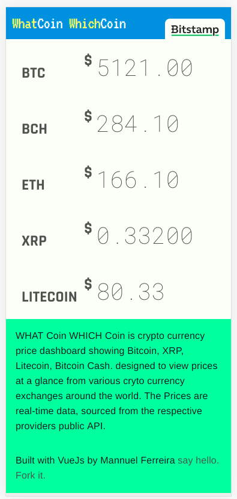

# What Coin Which Coin

> Cryptocurrency Price Dashboard for fun.

## Build Setup

Crypto currency price viewing dashboard.

## Local dev

To get started fork and clone the repo to your development machine:

```bash
git clone https://github.com/mannuelf/whatcoinwhichcoin
```

```bash
# install dependencies
$ npm install

# serve with hot reload at localhost:3000
$ npm run dev

```

## Build for production

```bash
# build for production and launch server
$ npm run build

$ npm start

# generate static project
$ npm run generate
```

### Why another crypto currency price dashboard/ticker

I love technology, I love design, typography and I love Vue Js. This project is an opportunity to play with all of the above.

Join in the fun. If you like fork it, or just enjoy using it, [Click here](https://whatcoinwhichcoin.com)



### Technology

- VueJs
- NuxtJs
- Progressive Web Application

#### NUXTJS

For detailed explanation on how things work, checkout [Nuxt.js docs](https://nuxtjs.org).
